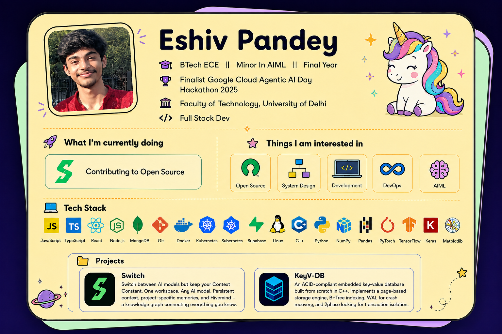

  

## 🛠 Tech Stack

  <!-- Animated (kept intentionally) -->
  
  
  
  

  <!-- Static (clarity-first) -->
  
  
  
  
  
  
  
  
  

## 🤖 Machine Learning & Deep Learning

  
  
  
  
  
  

---

## 📫 Contact Me

---

  <i>Focused on consistency, learning in public, and meaningful open-source contributions.</i>

